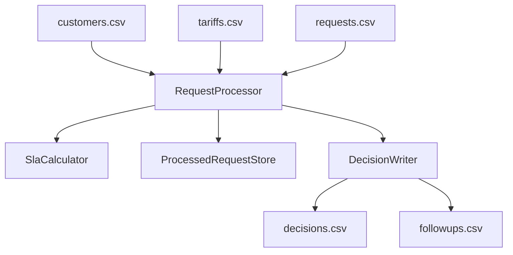

# Tariff Switch Request Processor

### Backend Engineering Case Study

This repository contains a conceptual case study demonstrating how an energy provider could process customer tariff-switch requests using a deterministic and testable backend workflow.

The project focuses on core engineering concerns commonly found in real-world backend systems, including idempotent processing, timezone-safe SLA calculations, input validation, and automated verification through unit tests.

This repository is intended for portfolio demonstration purposes and does not represent a production deployment.

---

# Overview

The application is a lightweight **.NET console application written in C#** that processes tariff-switch requests stored in CSV files.

For each request, the application:

* validates the input data
* applies business rules
* determines whether the request is approved or rejected
* calculates an SLA deadline
* generates deterministic output files
* ensures each request is processed **at most once**

The system runs locally and does **not depend on external services**.

---

# Why This Project

This case study demonstrates several engineering concerns commonly encountered in backend systems:

* deterministic batch processing
* safe handling of time-sensitive SLA deadlines
* idempotent processing across repeated runs
* validation of external input data
* reproducible outputs suitable for automated verification
* testable architecture with clearly separated components

The goal is to show how business rules can be translated into maintainable application logic.

---

# Tech Stack

* **.NET 10**
* **C#**
* **xUnit** for unit testing

---

# Architecture Overview

The application separates orchestration, business logic, time calculations, persistence, and output generation into dedicated components.

This separation improves:

* testability
* maintainability
* readability
* extensibility

### Architecture Diagram



---

```md
## Project Structure

- `Program.cs` — Entry point and runtime orchestration
- `RequestProcessor.cs` — Core business rule evaluation and request handling
- `SlaCalculator.cs` — SLA deadline calculation using Europe/Vienna local time semantics
- `DecisionWriter.cs` — Writes `decisions.csv` and `followups.csv`
- `ProcessedRequestStore.cs` — Persists processed request IDs across runs to guarantee idempotency
- `InputPathResolver.cs` — Resolves the input directory
- `InputPathValidator.cs` — Validates input configuration and CSV schema
- `inputFiles/` — Sample input data
- `outputFiles/` — Generated output files
- `processedRequestIDs/` — Storage for processed request IDs
- `SlaRequestProcessorCaseStudy.Tests/` — Unit tests verifying core logic

---

# Input Requirements

Default input directory:

```
./inputFiles
```

Required CSV files:

* `customers.csv`
* `tariffs.csv`
* `requests.csv`

---

# Expected CSV Headers

### customers.csv

```
CustomerId;Name;HasUnpaidInvoice;SLA;MeterType
```

### requests.csv

```
RequestId;CustomerId;TargetTariffId;RequestedAtISO8601
```

### tariffs.csv

```
TariffId;Name;RequiresSmartMeter;BaseMonthlyGross
```

---

# Business Rules

Each request is evaluated according to the following rules.

### Rejected Requests

A request is rejected if:

* the request data is malformed
* the customer ID is unknown
* the tariff ID is unknown
* the customer has unpaid invoices

Each rejected request includes a clear rejection reason.

### Approved Requests

Requests that pass validation are approved.

If the selected tariff requires a smart meter and the customer currently has a classic meter:

* the request is approved
* a follow-up action **“Schedule meter upgrade”** is generated
* the SLA deadline is extended accordingly

---

# SLA Logic

SLA deadlines depend on the customer's SLA level.

| SLA Level | Base Deadline |
| --------- | ------------- |
| Premium   | +24 hours     |
| Standard  | +48 hours     |

If a smart meter installation is required:

```
+12 additional hours
```

### Timezone Handling

All deadlines are:

* computed using **Europe/Vienna local time**
* **DST-safe**
* output in **ISO-8601 format**

The application uses the IANA timezone identifier:

```
Europe/Vienna
```

which is mapped correctly by .NET on Windows.

---

# Idempotent Processing

Each request is processed **at most once**, even across multiple application runs.

Processed request IDs are persisted in:

```
./processedRequestIDs/processed_ids.csv
```

If new rows are appended to `requests.csv`, subsequent runs process **only the newly added requests**.

---

# Output Files

Generated in:

```
./outputFiles
```

### decisions.csv

```
RequestId;Decision;Reason;SlaDueISO8601
```

* `Decision` = Approved / Rejected
* `Reason` is empty for approved rows

### followups.csv

```
RequestId;Action;DeadlineISO8601
```

Contains additional operational actions such as scheduling meter upgrades.

---

# Engineering Considerations

Several design decisions were made to keep the application robust and testable.

### Fail-fast validation

Configuration errors such as missing files or invalid CSV schemas immediately stop execution with a clear error message.

### Row-level fault tolerance

Invalid rows do not stop the entire run. Each faulty request is rejected individually.

### Deterministic output

The application produces predictable CSV outputs suitable for automated testing and verification.

### Idempotent execution

Requests are processed exactly once across multiple runs.

### Timezone-safe deadlines

SLA calculations follow **Europe/Vienna local time semantics**, ensuring correct behavior across daylight-saving transitions.

---

# Run the Application

From the repository root:

```bash
dotnet restore
dotnet run --project .
```

Custom input folder:

```bash
dotnet run --project . -- "./myInputFolder"
```

---

# Run Tests

```bash
dotnet test
```

---

# Documentation

Additional technical documentation is available in [`documentation/tariff_switch_processor_technical_documentation.pdf`](documentation/tariff_switch_processor_technical_documentation.pdf).

---
